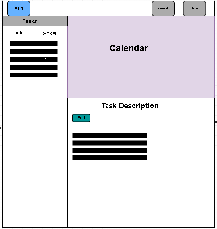
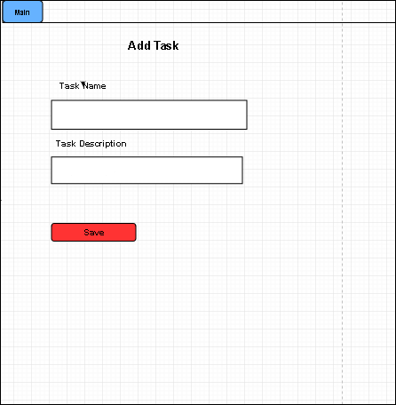
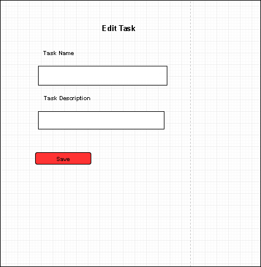
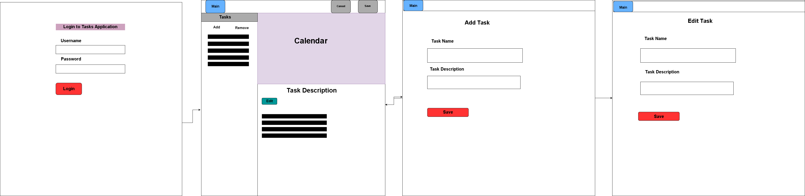

# Project Planning

### Wireframes

(Include at least 3 wireframes here, adding images or files to your the repository as necessary. Format them as a bulleted/unordered list with links to the files.)

* 
* 
* 
* 
* 

### Project Tracker!

https://www.pivotaltracker.com/n/projects/2237644

### Project Repo Link

https://github.com/agarcia3872/todoMVC-Authentication-app
